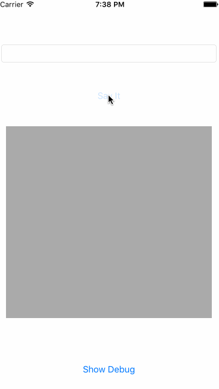

AhaDebugDashboard
=================

### Use

```
self.window = [[AhaDebugWindow alloc] initWithFrame:[[UIScreen mainScreen] bounds]];
NSArray * debugs = @[@{@"title": @"作弊", @"key": @"key_cheat", @"value": @NO},
                     @{@"title": @"日志", @"key": @"key_log", @"value": @"AhaLogViewController"}];
[AhaDebugManager sharedInstance].debugArray = debugs;
[AhaDebugManager sharedInstance].logSubmissionEmail = @"xxx@xxx.com";
``` 

### Demo

> shake to show Dashboard


